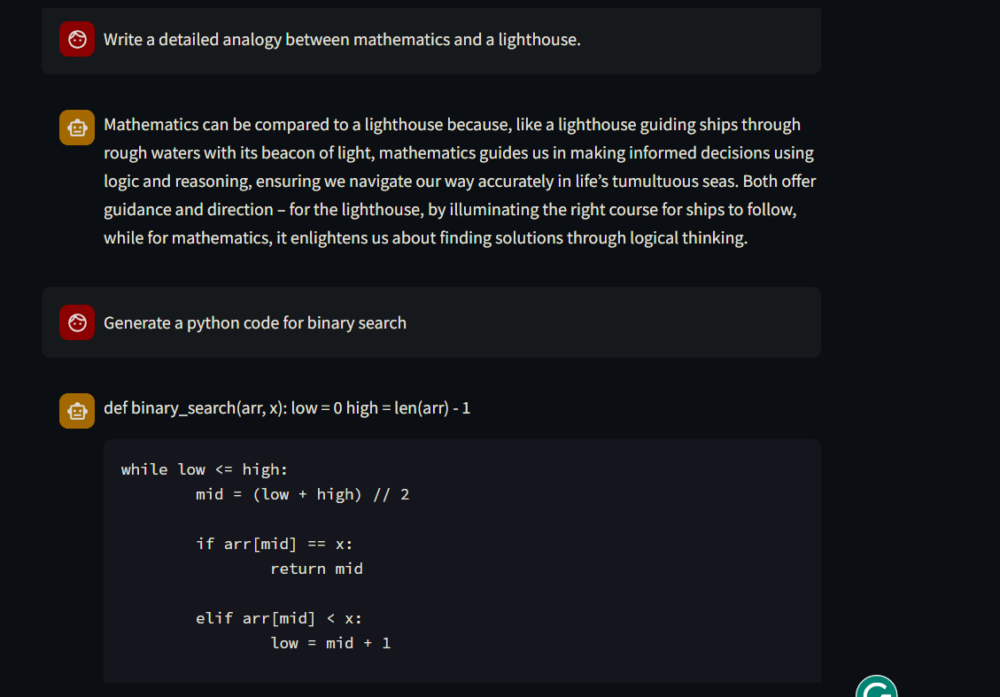
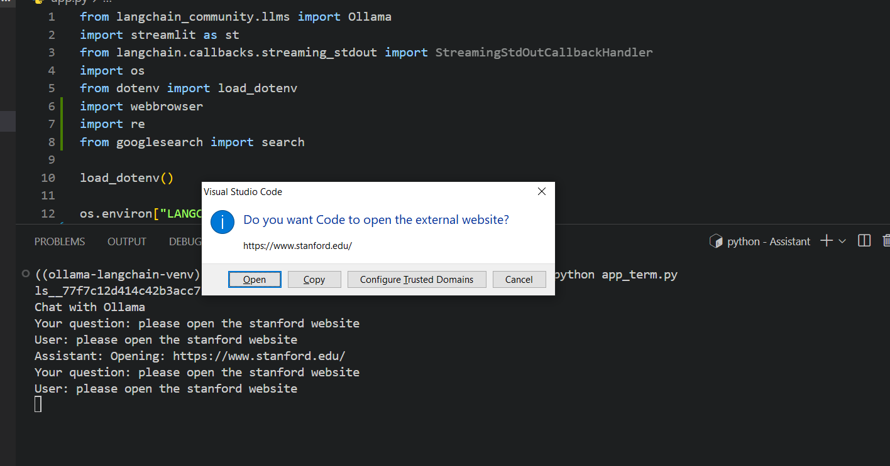
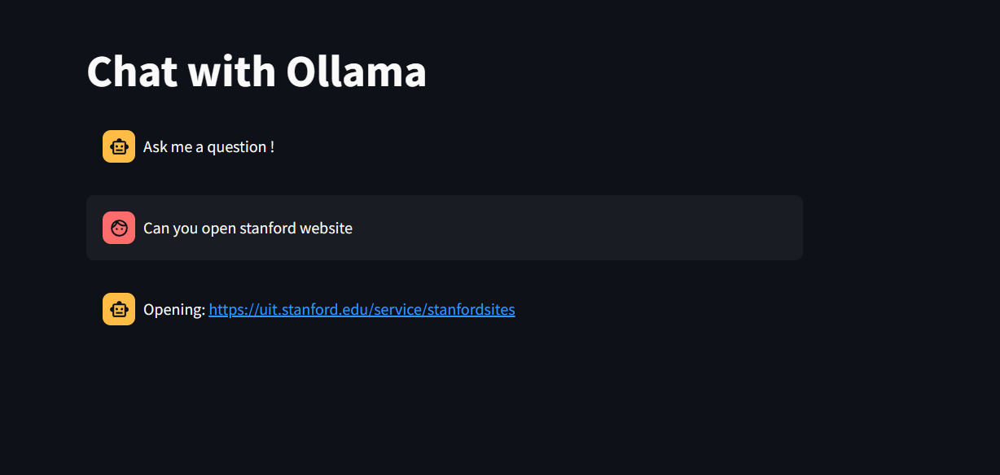
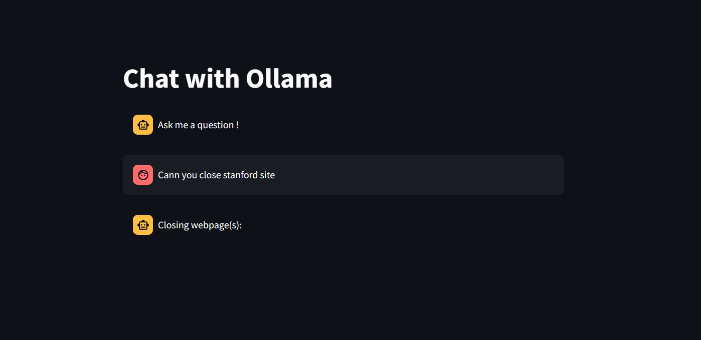
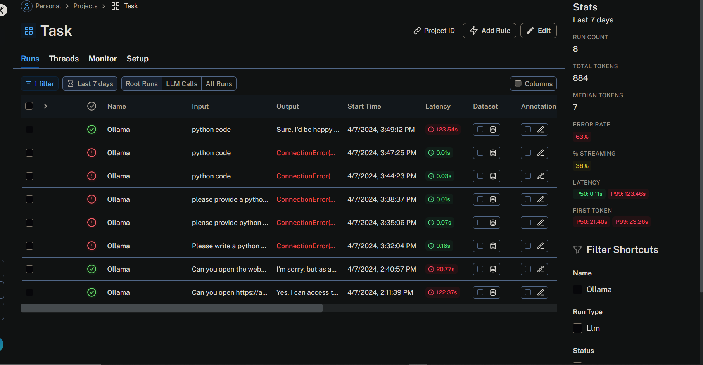

# Chat Assistant

- Building a Basic Webpage Opener and EXCEL SHEET (XLSX OR CSV) Question 
Answering Agent

## Screenshot - Conversational Agent:


## Requirements
Make sure to have following dependencies listed in your requirements.txt file:
- streamlit
- langchain
- langchain-community
- python-dot
- google

## Installation
```
Git clone the repo
``` 
```
python3 -m venv ./ollama-langchain-venv
```
```
source ./ollama-langchain-venv/bin/activate
```
```
docker build . -t yourdocker/ollama-langchain:0.5
```
```
ollama-langchain docker images
```
```
docker-compose up
```
```
docker exec -it ollama-langchain-ollama-container-1 ollama run phi
```

you should be able to see the downloaded model files and manifests in your local folder ./data/ollama (which is internally mapped to /root/.ollama for the container, which is where Ollama looks for the downloaded models to serve)

### Screenshot - Opening Website through natural prompt
Run
```
python app_term.py 
```
To converse from terminal

To converse from streamlit


### Closing website 
Streamlit has a sandboxed environment hence it can't redirect to another site. So we are giving the sites to open explicitly.
Couldn't implement because of limitations in webbrowser module of python, tried selenium which was also unsuccessful.


RAG training was done in this notebook
[Colab](https://colab.research.google.com/drive/11A9TldA9dDfRiEIRba1htxnWiPcNsvSo?usp=sharing)

## .env setup
LANGCHAIN_API_KEY="" <br/>
LANGCHAIN_PROJECT="Task" <br/>
Please comment the part if not required.

Use your own API key and set up a project name to see the analytics in Langsmith.
